  <h1>Hi There, I'm Tarun 😊</h1>

  

<h3 align="center">Full Stack AI Engineer</h3>

  

---

- I'm currently working on 

- I'm currently learning 

- I work using 

- I'm looking for help in 

- Ask me about 

- How to reach me

- Projects are available at

- Know about my experiences

-  Let's connect and collaborate on exciting projects!

---

  
  > **Engineering focused Full Stack AI Engineer & Researcher** with hands-on experience specializing in architecting and scaling **AI integrated, production ready web platforms** from early concept to real world deployment.
  
  > Demonstrated expertise in embedding **intelligent decision making, automation, and analytics** into modern web architectures. Strong emphasis on **clean architecture, performance optimization, microservice based backends, and cloud native deployment strategies** to deliver reliable, extensible, and high impact software solutions.

---

## 💼 Work Experience

| Role | Organization | Duration |
|:---:|:---:|:---:|
| **Technical Lead** | Dev Hive, Chandigarh University | March 2025 – Present |
| **Full Stack Developer & Researcher** | Dev Hive / Freelance | - |

---

## 🎯 Core Competencies

<table>
<tr>
<td width="50%" valign="top">

### 🌐 Full-Stack Development
- **Frontend**: React, Next.js, TypeScript, Tailwind CSS, GSAP
- **Backend**: NestJS, Express, FastAPI, Node.js, Python
- **Mobile**: React Native, Flutter, Swift, Kotlin
- **Real-time**: WebSockets, GraphQL, tRPC

</td>
<td width="50%" valign="top">

### 🤖 AI/ML & GenAI
- **Frameworks**: PyTorch, TensorFlow, scikit-learn
- **LLM Stack**: LangChain, LlamaIndex, Autogen
- **MLOps**: MLflow, DVC, Weights & Biases
- **Platforms**: Vertex AI, SageMaker, HuggingFace

</td>
</tr>
<tr>
<td width="50%" valign="top">

### ☁️ Cloud & DevOps
- **Cloud**: AWS, GCP, Azure
- **Orchestration**: Kubernetes, Docker, Terraform
- **CI/CD**: GitHub Actions
- **Monitoring**: Prometheus, Grafana

</td>
<td width="50%" valign="top">

### ⛓️ Blockchain & Web3
- **Smart Contracts**: Solidity, Hardhat, Foundry
- **Libraries**: ethers.js, web3.js, viem
- **Networks**: Ethereum, Polygon, NEAR, ICP
- **Tools**: IPFS, Chainlink, OpenZeppelin

</td>
</tr>
</table>

---

<h3 align="left">Languages and Tools:  </h3>

  
  
  
  
  
  
  
  
  
  
  
  
  
  
  
  
  
  
  
  
  
  
  
  
  

<h3 align="left">Connect with me: </h3>

---

### 📊 GitHub Statistics & Metrics

  
  

 

  
  

---

  Designed with ❤️ by Tarun Agnihotri. All stats update dynamically.

